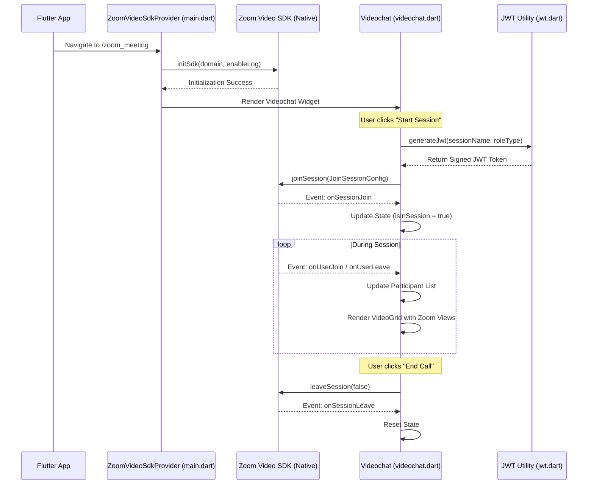
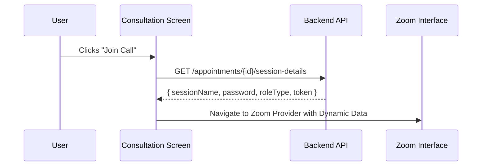

# Zoom Video SDK Calling Flow

This document describes the implementation and flow of the Zoom Video SDK integration within the EMR Application.

## 1. Sequence Diagram



## 2. Component Breakdown

### A. Initialization (`lib/main.dart`)

The `ZoomVideoSdkProvider` handles the lifecycle of the SDK at the application level.

- **Workflow**: `initState` -> `_initZoom()` -> `zoom.initSdk()`
- **Route**: `/zoom_meeting`

### B. Session Management (`lib/feature/view/videochat.dart`)

The `Videochat` widget manages the active call state.

- **`startSession()`**: Orchestrates the join process.
- **`_setupEventListeners()`**: Subscribes to Zoom events:
  - `onSessionJoin`: Triggered when the local user successfully joins.
  - `onUserJoin/Leave`: Manages the list of remote participants.
  - `onUserVideoStatusChanged`: Re-renders UI when video is toggled.
  - `onUserAudioStatusChanged`: Updates mute/unmute indicators.

### C. Security & Authentication (`lib/utils/jwt.dart`)

Zoom Video SDK requires a JWT for authentication.

- **Payload**:
  - `app_key`: SDK Key from `config.dart`.
  - `tpc`: Session Name.
  - `role_type`: 1 for Host, 0 for Participant.
  - `iat` / `exp`: Issued at / Expiry timestamps.

### D. UI Components

- **`VideoGrid`**: Uses `flutter_zoom_view.View` to render the native video stream for each user.
- **`ControlBar`**: Provides interactive buttons for call controls:
  - **Mute**: `zoom.audioHelper.muteAudio(userId)`
  - **Video**: `zoom.videoHelper.startVideo()` / `stopVideo()`
  - **Leave**: `zoom.leaveSession(false)`

## 3. Configuration (`lib/config.dart`)

Credentials and default session parameters are stored here:

- `ZOOM_SDK_KEY` / `ZOOM_SDK_SECRET`
- `sessionDetails`: Default test credentials.

## 5. API Integration Strategy

To move from hardcoded test sessions to dynamic, real-world consultations, the application should fetch session parameters from a backend API.

### A. Dynamic Data Flow

Instead of relying on `config.dart`, the `ConsultationsScreen` should receive session details from your appointment management API.



### B. Implementation Steps

1.  **Modify `ZoomService`**: Update the existing `lib/core/services/zoom_service.dart` or create a new one to fetch Video SDK session details.
2.  **Server-Side JWT**: For production, the JWT **must** be generated on your server using the `SDK_SECRET`. This prevents the secret from being exposed in the mobile app binary.
3.  **Update `Videochat` Constructor**: Modify the `Videochat` widget to accept a `Map` or `SessionModel` of parameters instead of importing `sessionDetails` from `config.dart`.

### C. Example API Integration

#### Service Layer (`lib/core/services/appointment_service.dart`)

```dart
Future<Map<String, String>?> fetchCallDetails(String appointmentId) async {
  final response = await http.get(Uri.parse('https://api.emr.com/call/$appointmentId'));
  if (response.statusCode == 200) {
    return Map<String, String>.from(jsonDecode(response.body));
  }
  return null;
}
```

#### Consumption in Consultation Screen

```dart
// Inside _ConsultationsScreenState
void _joinCall(String id) async {
  final callDetails = await AppointmentService().fetchCallDetails(id);
  if (callDetails != null) {
    Navigator.pushNamed(context, '/zoom_meeting', arguments: callDetails);
  }
}
```

## 6. Security Best Practices

1.  **JWT Expiry**: Ensure the server-generated JWT has a short expiry (e.g., 30 minutes).
2.  **SDK Key Protection**: Use environment variables or a secure vault for SDK keys during the build process.
3.  **Backend Validation**: The API should verify the user's appointment status and time before returning a session token.

## 7. Troubleshooting Build Errors

If you encounter `cannot access ZoomVideoSDKDelegate` during build, ensure that the Zoom SDK artifacts are explicitly included in `android/app/build.gradle.kts`:

```kotlin
dependencies {
    implementation("us.zoom.videosdk:zoomvideosdk-core:1.14.0")
    implementation("us.zoom.videosdk:zoomvideosdk-videoeffects:1.14.0")
    implementation("us.zoom.videosdk:zoomvideosdk-annotation:1.14.0")
}
```
